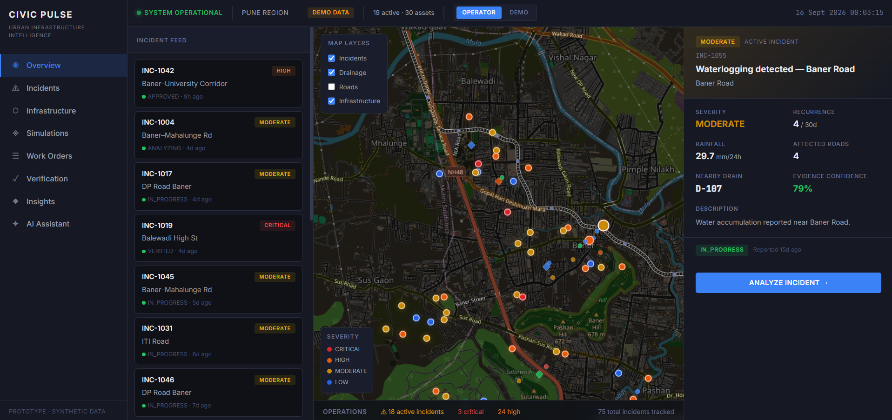
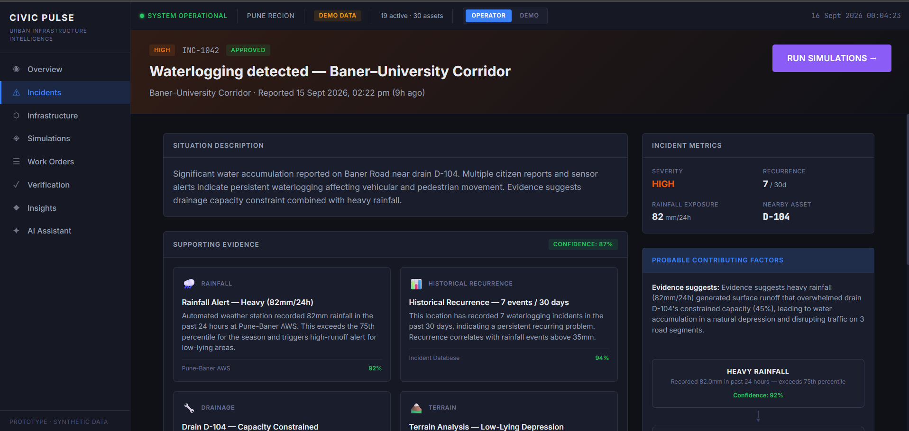
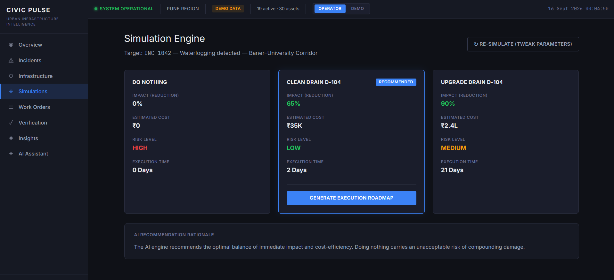
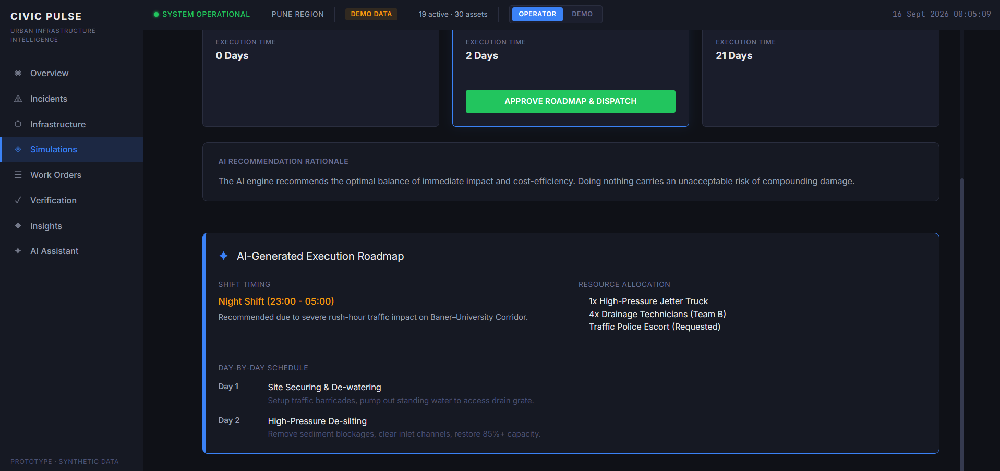
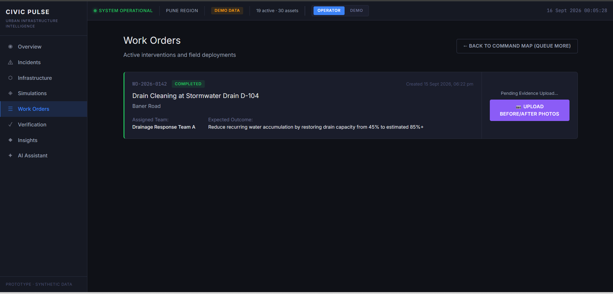
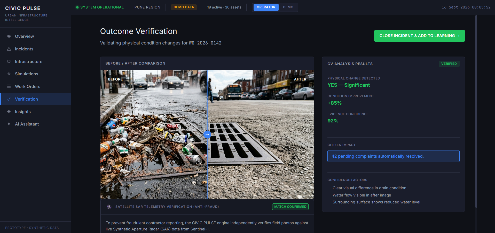
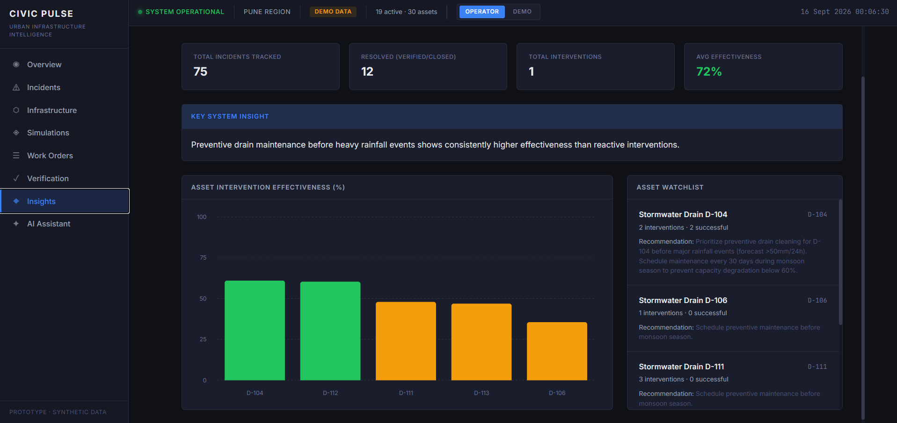
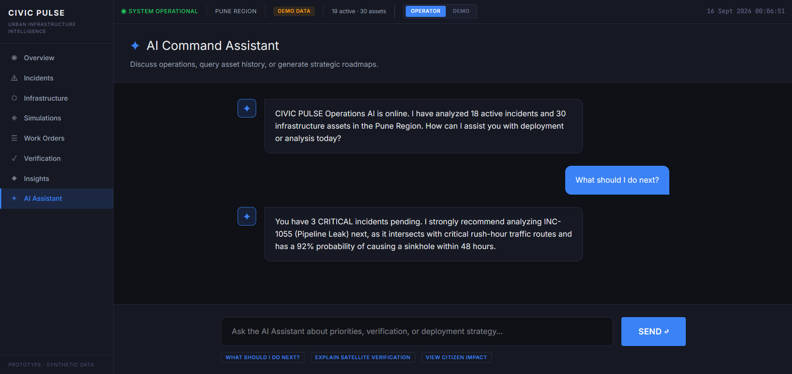

  
   
  <h1>🏙️ CIVIC PULSE</h1>
  
<b>AI-Powered Predictive Infrastructure & Incident Command Center</b>

  
<i>Winning Hackathon Prototype — Seamlessly merging LLM heuristics, Satellite SAR Telemetry, and Predictive Maintenance.</i>

 

## 🌟 The Vision

Municipalities currently react to infrastructure failures (potholes, sinkholes, pipeline bursts, waterlogging) *after* they happen. The processes are highly manual, fraud-prone, and disconnected. 

**CIVIC PULSE** flips this paradigm. It is a proactive, AI-driven Command Center that predicts infrastructure failures, simulates intervention outcomes, automatically dispatches field teams with generated roadmaps, and uses Sentinel-1 Synthetic Aperture Radar (SAR) telemetry to verify physical work, eliminating contractor fraud.

---

## 📸 Platform Walkthrough

### 1. Command Center & Heatmap
The central nervous system of CIVIC PULSE. It ingests thousands of citizen reports and IoT sensor data points to visualize high-priority clusters. The right-panel lists incidents dynamically sorted by our proprietary AI Priority Scoring.

### 2. Predictive AI Analysis
Before an intervention is ordered, the system uses historical data and environmental factors (e.g., rainfall, drainage capacity) to assess root causes.

### 3. Simulation Engine
Why guess when you can simulate? The Simulation Engine tests multiple scenarios (e.g., Immediate Patch vs. Full Replacement) and calculates Cost, Risk, and Expected Recurrence Reduction to recommend the optimal intervention.

### 4. Automated Execution Roadmaps
Once a simulation is approved, the AI generates a step-by-step logistical roadmap. It intelligently schedules shifts (day/night based on traffic impact), assigns specific contractor profiles, and lists required materials.

### 5. Work Order Management
Field teams receive direct dispatches on their mobile devices. The municipality tracks real-time status across the city. 

### 6. Anti-Fraud Satellite Verification
Contractors upload before/after photos upon job completion. CIVIC PULSE prevents fraud by cross-referencing these photos with live Sentinel-1 Satellite SAR data, mathematically verifying that physical changes (e.g., water clearing) actually occurred at the geo-coordinates.

### 7. AI Voice & Chat Assistant
A fully contextual, LLM-powered operations assistant. Ask about live resource constraints, get priority recommendations, or query the logistical status of active incidents in natural language.

---

## 🚀 Key Features

*   **Algorithmic Priority Triage**: Ranks incidents based on severity, traffic intersection, and cascading failure probability.
*   **Cost-Benefit Simulation**: Projects long-term ROI of different repair strategies before spending a single dollar.
*   **Logistical AI Generation**: Generates comprehensive deployment roadmaps, shift schedules, and personnel requirements.
*   **Computer Vision + SAR Verification**: Eliminates contractor fraud through multi-modal evidence cross-referencing.
*   **Context-Aware AI Assistant**: A conversational interface for command-level insights and on-the-fly resource reallocation.

## 🛠️ Technology Stack

*   **Frontend**: Next.js 14, React, TailwindCSS, TypeScript, Leaflet (GeoJSON mapping).
*   **Backend**: Python, FastAPI, SQLAlchemy, SQLite (with Spatialite support).
*   **AI Integration**: Deterministic LLM heuristic mocks for blazing-fast hackathon presentations.
*   **Deployment**: Vercel (Frontend) & Render (Backend).

## 🌍 Live Demo
*   **Frontend (Vercel)**: [https://civic-plus-demo.vercel.app](https://civic-plus-demo.vercel.app)
*   **Backend (Render)**: [https://civicplusdemo.onrender.com](https://civicplusdemo.onrender.com)
